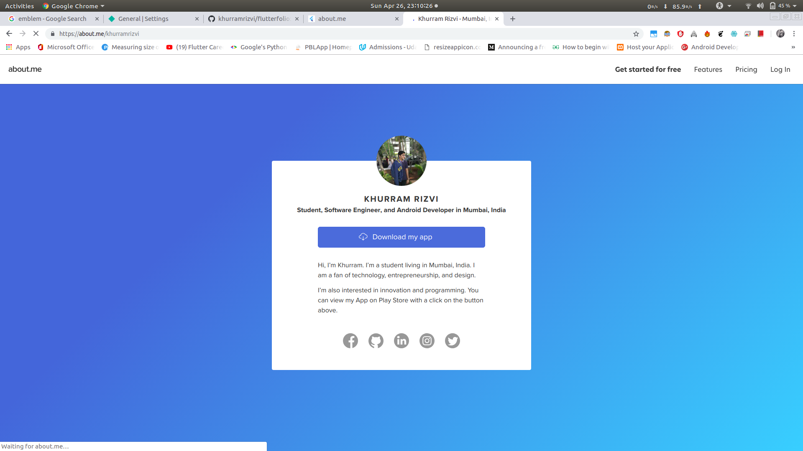
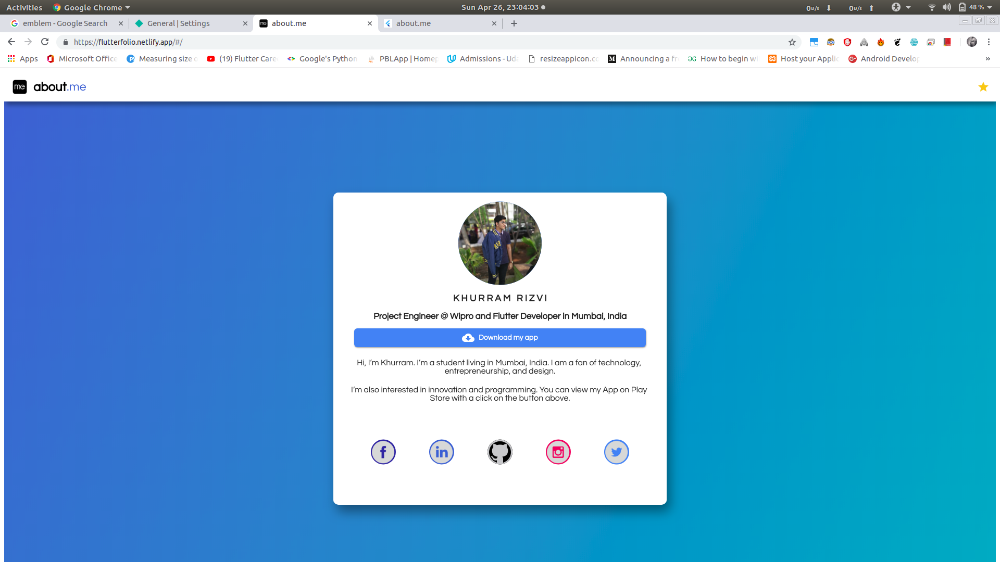
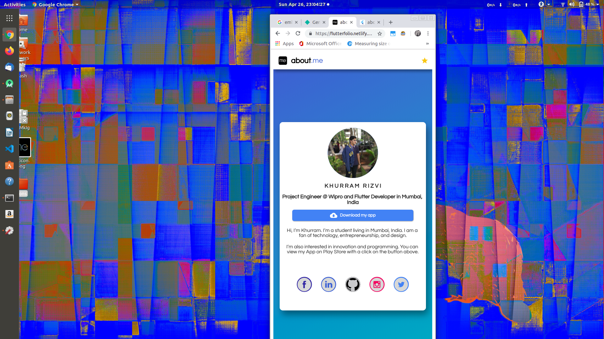

# flutterfolio - about.me

A Portfolio App built using Flutter for Web.

## Screenshots

### Original Portfolio: about.me

<table>
  <tr> 
  <td>  </td>
   </tr>
 </table>
 
  
  
 
 ## My Implementation with some UI tweaks
 
 ### FlutterFolio: about.me - Full Screen Mode
 
 <table>
  <tr> 
  <td>  </td>
   </tr>
  
  ### FlutterFolio: about.me - Responsive
  
  <tr> 
  <td>  </td>
   </tr>
 </table>
 
 ## Want your own portfolio?
 ### Simply update the Links and Description in lib\main.dart file
 
    
## If you like my work and want to show some ❤️, please consider giving a ⭐️ to this Repository.
